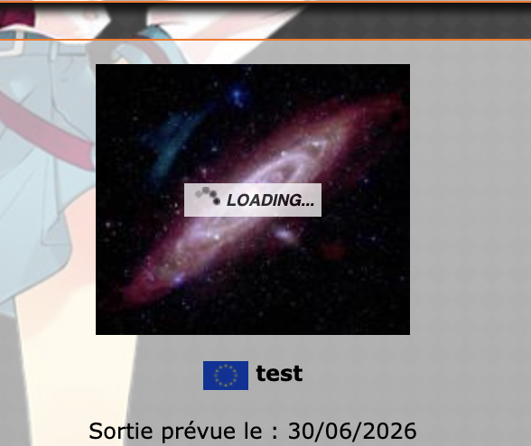
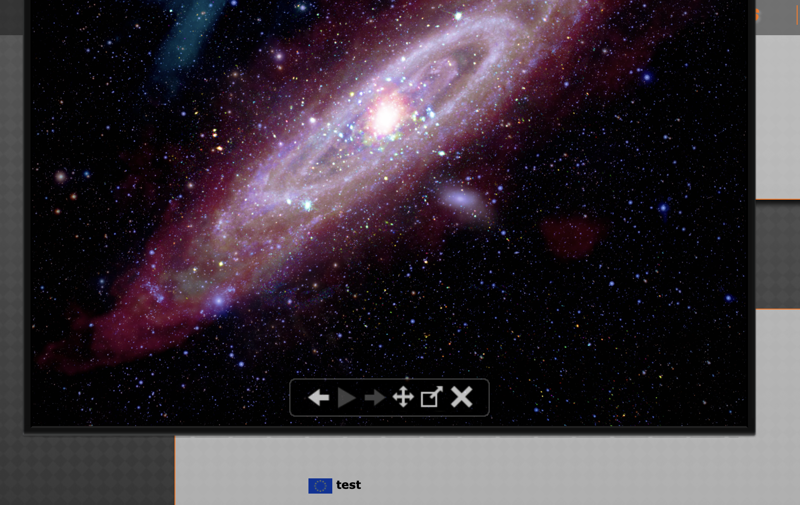
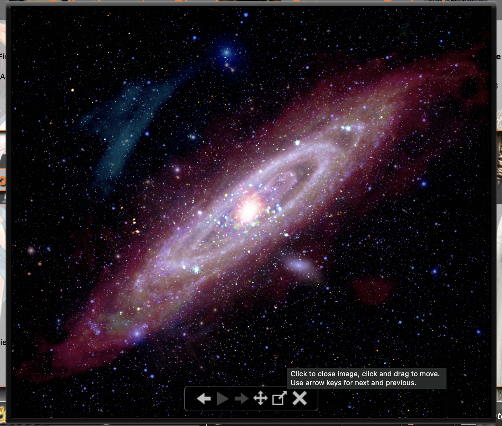

<p align="center">
  
</p>

<h1 align="center">svelte-lightslide</h1>

A draggable, accessible image lightbox & gallery for **Svelte 5** — a modern rebuild of [Highslide JS](https://web.archive.org/web/2018*/highslide.com), the lightbox I loved and used across my sites in the early 2010s.

Most modern lightboxes drop a full-screen image in the middle of the screen and call it a day. Highslide did something I always missed since: the image **expanded out of the thumbnail you clicked**, became a **little window you could drag around the page**, and carried a tidy control bar for navigation and a slideshow. This is that experience, rebuilt from scratch in Svelte 5 with runes — no jQuery, no dependencies, scoped CSS.

## Features

- 🪟 **Draggable popup** — grab the image and move it anywhere on the page (the Highslide signature)
- 🗂️ **Multiple open at once** — opt into non-modal mode and fan several draggable popups across the page, each with its own slideshow
- ✨ **Expand-from-thumbnail** — the popup grows out of the clicked thumbnail (FLIP animation), and shrinks back on close
- 🔍 **Full-size toggle** — switch between fit-to-screen and the image's native resolution
- ▶️ **Slideshow** — autoplay with a progress ring on the play button and a bar on the active thumbnail
- 🖼️ **Thumbnails, captions, counter** — optional, all themeable via an accent colour
- ⌨️ **Keyboard** — arrows to navigate, `Space` to play/pause, `F` for full size, `Esc` to close
- ♿ **Accessible** — real buttons, focus-visible outlines, `Esc` to close, reduced-motion aware
- 🧩 **Three usage patterns** — declarative gallery, single image, and many independent images on one page
- 📦 **Zero runtime dependencies**, scoped CSS

## The original

| Loading, then expand from the thumbnail | Dragged around the page | The control bar |
| --- | --- | --- |
|  |  |  |

<sub>Screenshots of the original Highslide-powered lightbox running on one of my game-collection sites (~2012–2024).</sub>

## Install

```bash
npm install svelte-lightslide
```

> Requires **Svelte 5** (peer dependency). The components ship with scoped CSS, so there's nothing else to import or configure.

## Usage

### 1 · Gallery

Give several images the same `group` and they form one gallery with thumbnails, navigation and slideshow.

```svelte
<script>
  import { LightboxManager, LightboxImage } from 'svelte-lightslide';

  const photos = [
    { src: '/full/1.jpg', thumbnail: '/thumb/1.jpg', caption: 'First' },
    { src: '/full/2.jpg', thumbnail: '/thumb/2.jpg', caption: 'Second' }
  ];
</script>

<LightboxManager accentColor="#ff7424">
  {#each photos as photo (photo.src)}
    <LightboxImage {...photo} group="my-gallery" />
  {/each}
</LightboxManager>
```

> `<LightboxImage>` triggers must live **inside** their `<LightboxManager>` — that's how they share its store (and how several galleries stay independent on one page).

**With dynamic data (a DB, an API…)** you don't need to pre-build an array — each `<LightboxImage>` registers itself in mount (source) order, so just loop once over your own data, wherever each image lives in your layout:

```svelte
<script>
  import { LightboxManager, LightboxImage } from 'svelte-lightslide';
  let { games } = $props(); // e.g. fetched from a DB
</script>

<LightboxManager accentColor="#ff7424">
  {#each games as game (game.id)}
    <article class="card">
      <h3>{game.title}</h3>
      <LightboxImage src={game.cover} thumbnail={game.thumb} caption={game.title} group="games" />
    </article>
  {/each}
</LightboxManager>
```

The triggers don't have to be siblings — scatter them through cards, table rows, whatever. They join the `"games"` gallery in order, and `<LightboxImage>` renders the clickable thumbnail itself. (Need to open from a button or with images that aren't on the page? Use the [programmatic API](#4--programmatic) instead.)

### 2 · Single image

One image, its own group — opens, drags, closes. No thumbnails, no navigation.

```svelte
<LightboxManager>
  <LightboxImage src="/full/cover.jpg" caption="Box art" group="cover" />
</LightboxManager>
```

### 3 · Independent images on one page

Give each image a **unique** `group` and they open on their own rather than as a gallery — handy for tables and lists.

```svelte
<LightboxManager>
  {#each rows as row (row.id)}
    <LightboxImage src={row.image} group={row.id} alt={row.name} />
  {/each}
</LightboxManager>
```

### 4 · Programmatic

Drive it from code via the manager's API.

```svelte
<script>
  import { LightboxManager } from 'svelte-lightslide';

  let manager;

  async function showGallery() {
    const images = await fetch('/api/gallery').then((r) => r.json());
    manager.registerImages('api', images);
    manager.openGroup('api', 0);
  }
</script>

<button onclick={showGallery}>Open gallery</button>
<LightboxManager bind:this={manager} />
```

### 5 · Multiple open (Highslide-style)

Set `multiple` and the lightbox becomes **non-modal**: there's no dim layer, and each click opens another draggable popup — fan several images across the page, each with its own slideshow. Click a popup to bring it to the front.

```svelte
<LightboxManager options={{ multiple: true }}>
  {#each photos as photo (photo.src)}
    <LightboxImage {...photo} group="gallery" />
  {/each}
</LightboxManager>
```

## Options

Pass via `<LightboxManager options={{ ... }} />`.

| Option | Type | Default | Description |
| --- | --- | --- | --- |
| `showThumbnails` | `boolean` | `true` | Thumbnail strip when a group has more than one image |
| `showCaption` | `boolean` | `true` | Caption bar under the image |
| `showCounter` | `boolean` | `true` | `n / total` counter |
| `enableKeyboard` | `boolean` | `true` | Arrow / Esc / Space / F shortcuts |
| `autoPlay` | `boolean` | `false` | Start the slideshow on open |
| `autoPlayInterval` | `number` | `4000` | Slideshow interval (ms) |
| `loop` | `boolean` | `true` | Wrap around at the ends |
| `dimBackground` | `boolean` | `true` | Dim the page behind the popup |
| `overlayOpacity` | `number` | `0.7` | Opacity of the dim layer |
| `draggable` | `boolean` | `true` | Allow dragging the popup |
| `multiple` | `boolean` | `false` | Allow several popups open at once — non-modal, no dim layer, each draggable with its own slideshow (the original Highslide behaviour) |
| `theme` | `'dark' \| 'light'` | `'dark'` | Light or dark chrome (controls, caption, thumbnails) |
| `accentColor` | `string` | `#ffffff` | Accent — slideshow ring/bar + active thumbnail. Also a top-level `accentColor` prop on `<LightboxManager>` |
| `preloadCount` | `number` | `1` | Neighbours to preload around the current image |

## Theming

Three layers, from quickest to deepest:

```svelte
<!-- 1 · accent + light/dark via props -->
<LightboxManager accentColor="#ff7424" options={{ theme: 'light' }} />
```

```css
/* 2 · override CSS variables from any ancestor — they inherit into the popup */
:root {
  --lb-font: "Inter", system-ui, sans-serif; /* controls + caption font */
  --lb-radius: 10px;                          /* image + chrome corner radius */
}
```

The component reads these custom properties: `--lb-accent`, `--lb-bg` (chrome background), `--lb-fg` (chrome foreground), `--lb-track` (ring track), `--lb-font`, `--lb-radius`. `accentColor` and `theme` set the first four for you; `--lb-font` and `--lb-radius` are yours to override.

## Manager API

Accessed through `bind:this`:

- `registerImages(group, images)` — set a group's images
- `openGroup(group, index?, originRect?)` — open a group
- `removeGroup(group)` — remove a group
- `close()` — close the lightbox
- `getGroups()` — snapshot of all groups

## Keyboard shortcuts

| Key | Action |
| --- | --- |
| `←` / `→` | Previous / next |
| `Space` | Play / pause slideshow |
| `F` | Toggle full size |
| `Esc` | Close |

## Development

```bash
npm install
npm run dev      # demo app at localhost:5173
npm run package  # build the distributable library into /dist
npm run check    # type-check
```

## Credits

Inspired by **Highslide JS** by Torstein Hønsi — a lightbox I loved to use for many years. This is an independent reimplementation in Svelte; no original Highslide code is used. The original project is now largely defunct (its site has been losing its assets and database), which is part of why I wanted to rebuild the experience I missed.

Demo images are public-domain imagery from **NASA / ESA** (Earth from GOES, Hubble deep-sky views, and a gopher tortoise at [Kennedy Space Center](https://images.nasa.gov/details/KSC-2014-2853)). They are used only in the demo app and are not part of the published package.

## License

MIT
